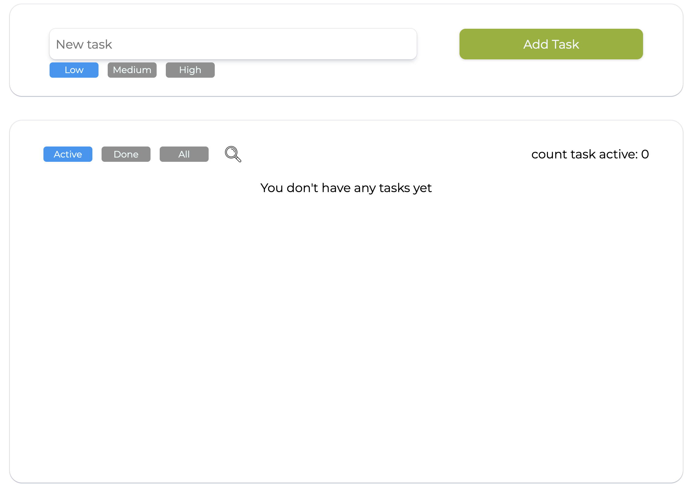
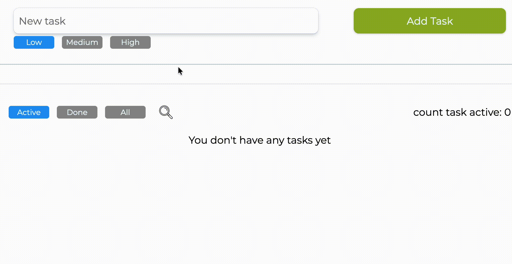

# 📝 Todo List Application

## 📖 Project Description

Todo List Application is a modern and responsive web application built with React that helps users efficiently manage their daily tasks.
The application provides a clean and intuitive interface for creating, tracking, and organizing tasks.

This project demonstrates working with React components, state management, user interactions, and responsive UI design.

---

## 🚀 Features

* ➕ Add new tasks
* ✅ Mark tasks as completed
* ❌ Delete tasks
* 🔍 Search tasks in real time
* 🔊 Sound notification when completing tasks
* 📱 Responsive layout (desktop & mobile)
* ⚡ Fast performance with Vite

---

## 🛠️ Tech Stack

* **Frontend:** React, Vite
* **Styling:** SCSS
* **Language:** JavaScript (ES6+)
* **Code Quality:** ESLint

---

## 📂 Project Structure

```
src/
 ├── components/
 │   ├── TodoForm.jsx
 │   ├── TodoItem.jsx
 │   ├── TodoList.jsx
 │   └── UseWindowWidth.jsx
 ├── styles/
 │   └── App.scss
 ├── assets/
 ├── img/
 ├── sound/
 ├── App.jsx
 └── main.jsx
```

---

## ⚙️ Getting Started

### 1. Clone the repository

```
git clone https://github.com/AnthonyWwWw/TodoListApplication.git
```

### 2. Navigate to the project directory

```
cd TodoListApplication
```

### 3. Install dependencies

```
npm install
```

### 4. Run the development server

```
npm run dev
```

### 5. Open in browser

```
http://localhost:5173
```

---

## 📸 Screenshots

### 🏠 Main Page



### ➕ Adding a Task



### ✅ Completed Task


### 🔍 Search Function


### 📱 Mobile View


---

## 🧠 Implemented Functionality

* Dynamic task creation using controlled inputs
* State management with React hooks
* Conditional rendering for task status
* Event handling (add, delete, complete)
* Real-time filtering (search)
* Audio feedback integration
* Responsive design with SCSS
* Component-based architecture

---

## 🔮 Future Improvements

* ✏️ Edit tasks
* 🧲 Drag & Drop sorting
* 🌙 Dark / Light theme
* 💾 Local storage or backend integration
* 🔐 User authentication

---

## 🌐 Live Demo

*(add link after deployment to Vercel / Netlify)*

---

## 📄 License

This project is licensed under the MIT License.

---

## 👨‍💻 Author

GitHub: https://github.com/AnthonyWwWw
